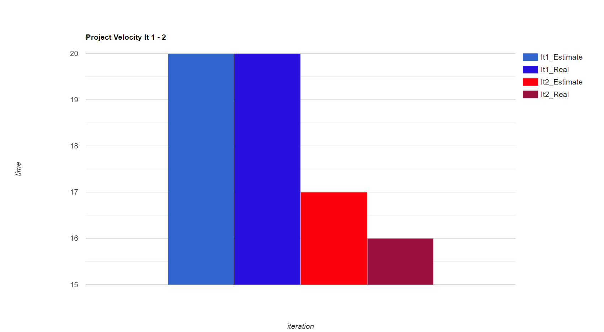

RETROSPECTIVE.MD

Just after the second iteration, before beginning work on the third iteration, we discussed our successes and shortcomings as a group. We felt that as a team we worked very well together, with a majority of groups that we have been a part of we found that there is always that ‘weak link’ where the other members have to step up a bit in order to complete the project. This group had no weak link. We feel that we are all strong individuals that mesh well together and have gotten along very well. We are proud of our method of coming up with features and assigning the given features. We used a first-come-first-served method, where someone would claim their respective feature. Each member learned a lot of gui layer work, while specializing in a specific area of the project as well. For example, we have one member that spent most of their time on the database, while still contributing features to the application as well. 

We felt that there was room for improvement in time management as well as undertaking more than we should. We were excited for the project and wanted to add a lot of fun features, however sometimes those features would take a lot more time than expected and we would find ourselves racing the deadline or sacrificing more time in other aspects of our life in order to meet our goals. We also discussed how we would go about improving our time management. We decided to take an emphasis on what feature we were developing and make a more educated guess on to how long the feature would take, by researching a bit and making a plan for how we will create our features and using the extended knowledge to properly make a time estimate. Additionally, we plan on meeting more frequently before the deadline as to avoid spending many hours before the deadline. 

Lastly, we also found that our merge from our respective features to the main branch on gitlab was painstakingly difficult. Merge conflicts caused quite a few hours in time. We planned to communicate more frequently and effectively on what specific areas of the code we were working on as to avoid any large unnecessary merge conflicts. The success of our solutions will be evaluated by examining our project velocity for the third iteration, as well as if we had to meet for several hours to fix merge conflicts or spending several hours before the deadline finishing everything up. We would like to see our time estimates being quite similar to our actual time spent, as well as an easy and quick merge from our respective branches into main with no stress at the deadline. In short, we feel that the we have built the project quite well and each member has excelled in their respective areas, however we undertook too much in specific areas and would like to ease the overall stress levels (personally and project-wise) to ensure that our product is as we discussed with many avoidable issues regarding git and time management being fixed. We feel that solving our time issues now will be one of the most important lessons that we will use outside of the classroom and in the real world.

ITERATION 1 AND 2 VELOCITY

Our velocity uses 'days' as units of measurement. One 'day' is a workday of 6-8 hours of work. As you can see our estimates seem to be close and the velocity seems to not be an issue, however if you look at the raw data then you can see then our estimates only line up due to outliers in the project. These outliers are due to major oversites in time estimates as well as solving merge issues with git. Here is the raw data: 

Estimate; 20
4
3
4
3
3

Spent; 20
3
3
6
4
4

Iteration 2:

Estimate; 17
4
4
2
6
1

Spent; 16
7
4
2
1
2

