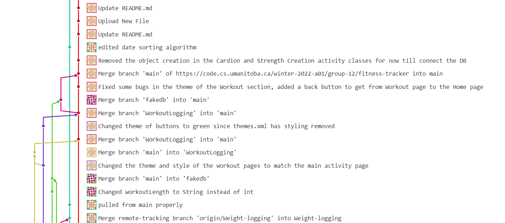

Iteration 1 Worksheet
=====================

Adding a feature
-----------------

The 'Workout logging' feature (see #19) went through a few changes along the way, it was divided into Cardio and Strength workout as it was being developed since Cardio requires distance measurements, and a Strength workout requires Sets and Reps. So there is a main Workout page, and has two buttons, one linking to 'new strength workout' the other to 'new cardio workout', which will take you to the associated forms to create these.

This portion wasnt added until the logic and tests were completed. The tests were based on the Logic layer dealing with validation the user inputs (dates, workout time, distances, sets, reps). These tests can be found at https://code.cs.umanitoba.ca/winter-2022-a01/group-12/fitness-tracker/-/tree/main/app/src/test/java/com/example/fitness_tracker/business . It was pushed through the WorkoutLogging branch by Brendan, whom made a merge request and this request was approved by Hao and merged by Zach (see !5 for the merge request). The UI was then styled to match the login page, and was commited and merged again to fix some of this UI detail (!11). 

Exceptional code
----------------

When logging weight, a user is required to enter their a date along with their weight. While there were a number of exceptions that were handeled, for this aspect of the project we will be highlighting the exception prompted by try to add invalid date format to a users weight history. More specifically, the exception thrown when a date does not match the format that our implementation requires, or when a user tries to enter a future date. Even if the date is valid, an exception will be thrown when because there has been a failure to follow the recommended formart.  
This is link to the exception testing
https://code.cs.umanitoba.ca/winter-2022-a01/group-12/fitness-tracker/-/blob/main/app/src/test/java/com/example/fitness_tracker/business/WeightLoggerTest.java (lines 146-160).

Branching
----------

Link To branching strategy
https://code.cs.umanitoba.ca/winter-2022-a01/group-12/fitness-tracker/-/tree/main#branching-strategy 

Using our strategy, in the below screenshot you can see that we have our own branches to which we merge on to main once our feature is ready for distribution or is functional enough for proper use. By merging our features with main, we try to do so in a staggered fashion to fix and merging issues one person at a time, as at times we have worked on the same files in different branches.

Above is the screenshot of examples for our branching strategy. You can see that we pull changes from main into our separate branches, then we merge our changes on to main after any conflicts are fixed, the merges are also approved by other members to ensure functionality remains on the main branch. We find that this method suits us best as consistency is kept throughout the project as we move from each working update to the next, and any issues with our current features can be fixed incrementally as we merge each feature to main seperately. 

SOLID
-----

https://code.cs.umanitoba.ca/winter-2022-a01/group-13/unnamed-budgeting-app/-/issues/38

Agile Planning
--------------

We deleted "View work out history" user story because it is duplicated with “Fitness history on past days” feature (#31). In addition, we add three new user story: “View Account Information” (#45) for feature “Create an account” (#17), "proper implement of create account and login" for feature “Create an account” (#17), and “Cardio workout distance”(#46)for feature “Workout Logging” (#19).
